# 四海订单处理系统整体流程图

## 系统架构流程

```mermaid
flowchart TB
    Start[系统启动入口] --> InitConfig[加载系统配置]
    
    InitConfig --> ModeSelect{运行模式选择}
    
    %% CLI 模式分支
    ModeSelect -->|CLI 模式| CLIEntry[run.py]
    CLIEntry --> CLILauncher[OrderProcessorLauncher<br/>启动器初始化]
    CLILauncher --> CLIEnvCheck[环境检查与准备]
    CLIEnvCheck --> CLIFileCheck[检查必需文件]
    CLIFileCheck --> CoreProcess1[核心处理流程]
    
    %% Server 模式分支
    ModeSelect -->|Server 模式| ServerEntry[start_server.py]
    ServerEntry --> ServerLauncher[ServerLauncher<br/>启动器初始化]
    ServerLauncher --> ServerEnvCheck[环境检查与准备]
    ServerEnvCheck --> FrontendCheck{前端构建检查}
    FrontendCheck -->|未构建| BuildFrontend[npm run build<br/>构建前端]
    FrontendCheck -->|已构建| StartAPI[启动 FastAPI 服务]
    BuildFrontend --> StartAPI
    
    StartAPI --> APIRouter[API 路由注册]
    APIRouter --> WebUI[Web 界面]
    WebUI --> FileUpload[文件上传接口<br/>/api/upload]
    FileUpload --> TaskCreate[任务创建接口<br/>/api/process]
    TaskCreate --> CoreProcess2[核心处理流程]
    
    %% 核心处理流程
    CoreProcess1 --> ProcessStart[ProductStandardizer<br/>处理器初始化]
    CoreProcess2 --> TaskManager[TaskManager<br/>任务管理器]
    TaskManager --> ThreadCreate[创建后台线程]
    ThreadCreate --> ProcessStart
    
    ProcessStart --> Step1[步骤1: 读取订单数据<br/>read_order_data_from_file]
    Step1 --> Progress10[进度更新: 10%]
    
    Progress10 --> Step2[步骤2: 解析原始数据<br/>parse_raw_data]
    Step2 --> ParseShop[提取店铺信息]
    ParseShop --> ParseProduct[提取商品信息]
    ParseProduct --> Progress30[进度更新: 30%]
    
    Progress30 --> Step3[步骤3: 提取商品变体<br/>extract_all_product_variants]
    Step3 --> LocalParse{本地正则解析}
    LocalParse -->|成功| NormalizeName[标准化商品名称]
    LocalParse -->|失败| AIBatchParse[AI 批量解析<br/>_batch_parse_with_ai]
    AIBatchParse --> NormalizeName
    NormalizeName --> Progress40[进度更新: 40%]
    
    Progress40 --> Step4[步骤4: 创建商品映射<br/>create_product_mapping]
    Step4 --> DeepseekAPI[调用 Deepseek API<br/>生成标准映射表]
    DeepseekAPI --> MappingResult[商品名称映射字典]
    MappingResult --> Progress55[进度更新: 55%]
    
    Progress55 --> Step5[步骤5: 标准化数据<br/>standardize_data]
    Step5 --> SmartParse[智能解析商品行<br/>smart_parse_product_line]
    SmartParse --> MapToStandard[映射到标准商品名称]
    MapToStandard --> BuildShopData[构建店铺商品数据]
    BuildShopData --> Progress75[进度更新: 75%]
    
    Progress75 --> Step6[步骤6: 更新 Excel<br/>update_excel_file]
    Step6 --> LoadExcel[openpyxl 加载 Excel]
    LoadExcel --> FindColumn[查找店铺对应列]
    FindColumn --> FindRow[查找商品对应行]
    FindRow --> WriteData[写入商品数量]
    WriteData --> SaveFile[保存 Excel 文件<br/>保持原格式]
    SaveFile --> Progress100[进度更新: 100%]
    
    %% 输出结果
    Progress100 --> OutputMode{输出方式}
    OutputMode -->|CLI 模式| CLIOutput[控制台输出<br/>显示处理日志]
    OutputMode -->|Server 模式| ServerOutput[更新任务状态<br/>提供下载链接]
    
    CLIOutput --> Complete[处理完成]
    ServerOutput --> DownloadAPI[文件下载接口<br/>/api/download]
    DownloadAPI --> Complete
    
    %% 进度回调系统
    Progress10 -.-> ProgressCallback[进度回调系统<br/>progress_callback]
    Progress30 -.-> ProgressCallback
    Progress40 -.-> ProgressCallback
    Progress55 -.-> ProgressCallback
    Progress75 -.-> ProgressCallback
    Progress100 -.-> ProgressCallback
    
    ProgressCallback -.-> LogUpdate[日志更新]
    ProgressCallback -.-> StatusUpdate[状态更新]
    
    %% 样式定义
    classDef entryPoint fill:#e1f5e1,stroke:#2d7a2d,stroke-width:2px
    classDef apiNode fill:#e1f0ff,stroke:#2d5a7a,stroke-width:2px
    classDef processNode fill:#fff4e1,stroke:#7a5a2d,stroke-width:2px
    classDef aiNode fill:#ffe1f0,stroke:#7a2d5a,stroke-width:2px
    classDef progressNode fill:#f0e1ff,stroke:#5a2d7a,stroke-width:2px
    classDef completeNode fill:#e1ffe1,stroke:#2d7a5a,stroke-width:2px
    
    class Start,ModeSelect entryPoint
    class StartAPI,APIRouter,FileUpload,TaskCreate,DownloadAPI apiNode
    class Step1,Step2,Step3,Step5,Step6 processNode
    class Step4,DeepseekAPI,AIBatchParse aiNode
    class Progress10,Progress30,Progress40,Progress55,Progress75,Progress100,ProgressCallback progressNode
    class Complete completeNode
```

## 系统模块说明

### 入口模块
- **run.py**: CLI 模式启动脚本
- **start_server.py**: Server 模式启动脚本

### 核心处理模块
- **ProductStandardizer**: 商品标准化处理器
  - 订单数据读取
  - 数据解析
  - 商品映射
  - Excel 更新

### API 服务模块
- **FastAPI 应用**: backend/main.py
  - 文件上传接口
  - 任务处理接口
  - 状态查询接口
  - 文件下载接口

### 任务管理模块
- **TaskManager**: backend/task_manager.py
  - 任务创建与管理
  - 后台线程处理
  - 进度跟踪
  - 结果文件管理

### 前端模块
- **Web 界面**: frontend/
  - 文件上传组件
  - 任务列表展示
  - 进度实时更新
  - 结果下载

## 数据流转

1. **输入**: order.txt + Excel 模板
2. **解析**: 店铺信息 + 商品信息
3. **映射**: AI 生成标准商品名称映射
4. **标准化**: 统一商品名称和数量
5. **输出**: 填充完成的 Excel 文件

## 技术栈

- **后端**: Python + FastAPI
- **AI**: Deepseek API
- **数据处理**: pandas + openpyxl
- **前端**: Vue.js
- **任务管理**: 多线程 + 内存存储
